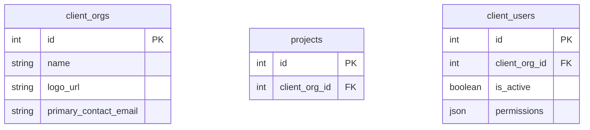

# Client-Facing Portal Specification

## 1. Goal
Give ZMCK clients a secure workspace to review live project metrics, approve submissions, and download deliverables without relying on email threads. The experience should surface only the data that pertains to the client’s projects and enforce read-only access unless explicitly granted (e.g., approvals).

## 2. Personas & Permissions
| Persona | Access | Capabilities |
| --- | --- | --- |
| Client Executive | All projects tied to their organization | View dashboards, approve time/expenses, download invoices & documents |
| Client Manager | Subset of projects | Same as above but scoped to assigned projects |
| Internal Account Lead | Mirrors existing admin view | Switch between internal/external view, masquerade to troubleshoot |

### Permission Model
1. Extend `users` table with `is_client_portal_user`, `client_org_id`.
2. New `client_orgs` table for client-specific settings (branding, default approvals, notification prefs).
3. Access checks ensure every request filters by `client_org_id` and project membership.

## 3. Core Features
1. **Project Overview**
   - Status summary (phase, health, upcoming milestones).
   - Budget vs actuals and hours burned.
   - Key contacts & next actions.

2. **Approvals Center**
   - Queue of pending time entries, expenses, invoices relevant to the client.
   - Approve/Reject with optional comments.
   - Bulk approve and searchable history.

3. **Documents & Deliverables**
   - Shared document repository per project.
   - Version history, download links, and optional acknowledgement workflow.

4. **Notifications**
   - Email + in-app notifications when approvals are required or milestones slip.
   - Preference center per client user.

## 4. Architecture
### Backend
1. New router namespace `client-portal` with JWT auth using client accounts.
2. Shared services but strict filters (e.g., `project_id IN clientProjects`).
3. Signed download URLs for documents.
4. Audit log entries for every client action (approval, download, comment).

### Frontend
1. Separate `ClientApp` bundle under `/client`.
2. Tailored layout (simplified nav: Dashboard, Approvals, Documents, Settings).
3. Use existing component library but with client-friendly theme (custom logo, colors).

## 5. Data Model Extensions

## 6. Security Considerations
1. Force MFA for client users (email OTP or authenticator).
2. Rate limit login attempts and approvals.
3. Signed URLs expire within 15 minutes; require JWT refresh afterward.
4. Ensure audit logs capture IP/user-agent for compliance.

## 7. Implementation Phases
1. **Phase 1 – Foundation**
   - DB migrations (`client_orgs`, `client_users` fields).
   - Authentication flow, basic dashboard read-only views.
2. **Phase 2 – Approvals & Documents**
   - Approvals queue, document repository integration.
   - Notifications for approvals.
3. **Phase 3 – Customization**
   - Branding options, preference centers, public API hooks.

## 8. Open Questions
1. Do clients need SSO (e.g., Azure AD)? If yes, plan for OAuth/SAML.
2. Should approvals adjust internal workflow (e.g., block billing until client signs off)?
3. Are there regulatory requirements (e.g., ISO, SOC) that affect data retention?

---
Next step: create migrations & auth scaffolding for client orgs, then spin up the `/client` frontend module.

